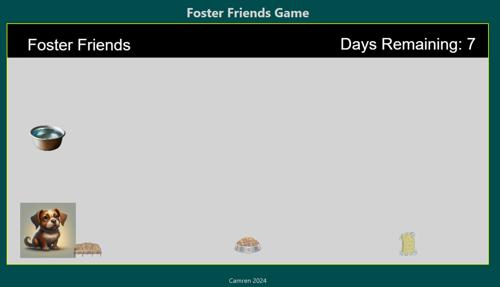
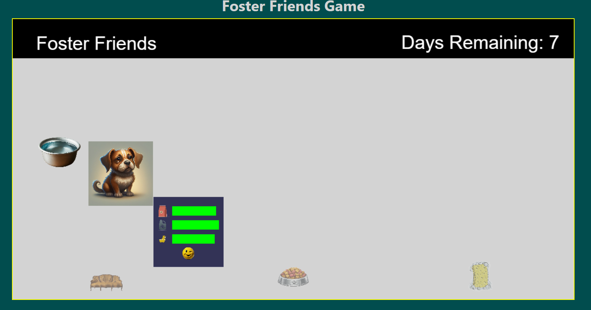

# FosterFriends
Foster Friends is a web-based virtual pet game aimed at fostering empathy and responsibility towards animals. Players will take on the role of a foster parent for a variety of adoptable pets, caring for their needs, playing with them, and building a bond. This is a game that kids and adults both can enjoy, where they can both have fun and help animals in need. In the game, you can foster and take care of different pet, and after completing the foster one can help give treats to animals in need. 

Features:
Pet Functionality: The Pet will have a timer for hunger, water, and baths. These will all be bars that deplete with time. The Pet will move around randomly, but the path will be interrupted when food is placed,  or water time. There is a timer on fostering where the pet is taken away, and experience is earned.
Decorate the pets play space: Users will be able to decorate the pets play place with a multitude of different sprites. 

Language/Framework:
•	HTML/CSS/JavaScript
•	Phaser

