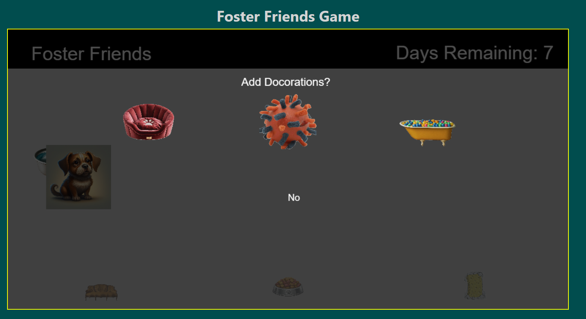

# FosterFriends
Foster Friends is a web-based virtual pet game aimed at fostering empathy and responsibility towards animals. Players will take on the role of a foster parent for a variety of adoptable pets, caring for their needs, playing with them, and building a bond.

